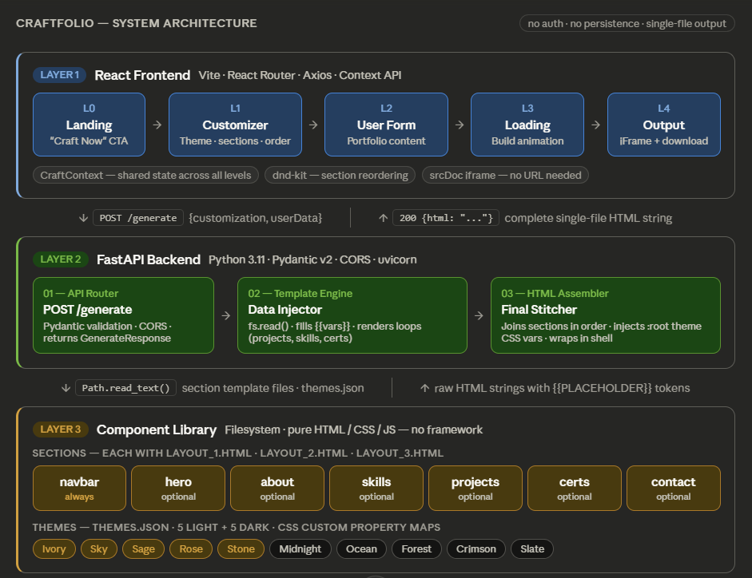

```
CraftFolio
```
# Full architecture plan — 




## Monorepo Folder Structure

```
craftfolio/
├── frontend/                        # Layer 1 — Vite + React
│   ├── src/
│   │   ├── pages/
│   │   │   ├── Landing.jsx          # Level 0: hero page, CTA button
│   │   │   ├── Customizer.jsx       # Level 1: theme picker + dnd section reorder
│   │   │   ├── UserForm.jsx         # Level 2: multi-section form
│   │   │   ├── Loading.jsx          # Level 3: animation + API call trigger
│   │   │   └── Output.jsx           # Level 4: srcDoc iframe + download/copy
│   │   ├── components/
│   │   │   ├── ThemePicker.jsx      # 10 theme swatches (light/dark tabs)
│   │   │   ├── SectionReorder.jsx   # dnd-kit drag-drop list
│   │   │   ├── LayoutSelector.jsx   # 3 layout previews per section
│   │   │   └── IframePreview.jsx    # wrapper with srcDoc + sandbox
│   │   ├── context/
│   │   │   └── CraftContext.jsx     # global state: customization + userData + generatedHtml
│   │   ├── api/
│   │   │   └── craftApi.js          # axios POST /generate
│   │   ├── App.jsx                  # React Router: / → /customize → /form → /loading → /output
│   │   └── main.jsx
│   ├── package.json
│   └── vite.config.js               # proxy /generate → localhost:8000 (dev)
│
├── backend/                         # Layer 2 — FastAPI
│   ├── main.py                      # app init, CORS, router include
│   ├── models.py                    # Pydantic v2: GenerateRequest, UserData, Customization
│   ├── generator/
│   │   ├── __init__.py
│   │   ├── template_engine.py       # load_section_template() + inject_user_data()
│   │   └── assembler.py             # build_portfolio() — the core orchestrator
│   └── requirements.txt             # fastapi, uvicorn, pydantic
│
└── library/                         # Layer 3 — Filesystem (static files)
    ├── sections/
    │   ├── navbar/
    │   │   ├── layout_1.html        # sticky top nav, hamburger mobile
    │   │   ├── layout_2.html        # sidebar nav
    │   │   └── layout_3.html        # minimal floating nav
    │   ├── hero/
    │   │   ├── layout_1.html        # split: text left, image right
    │   │   ├── layout_2.html        # centered, large type
    │   │   └── layout_3.html        # asymmetric with gradient blob
    │   ├── about/                   # 3 layouts each
    │   ├── skills/                  # 3 layouts (chips / bars / grid)
    │   ├── projects/                # 3 layouts (cards / list / masonry)
    │   ├── certifications/          # 3 layouts
    │   └── contact/                 # 3 layouts (no form submission)
    ├── base/
    │   ├── base.css                 # resets, typography, .btn-primary, .chip etc.
    │   └── animations.js            # IntersectionObserver scroll-in animations
    ├── themes/
    │   └── themes.json              # 10 theme objects with CSS var maps
    └── wrapper.html                 # outer shell: DOCTYPE + <head> + {{SLOTS}}
```

---

## Data Models — `backend/models.py`

```python
from pydantic import BaseModel
from typing import List, Optional, Dict

class Customization(BaseModel):
    theme: str                                  # "Midnight", "Ivory", etc.
    sections_order: List[str]                   # e.g. ["hero","about","projects","contact"]
    excluded_sections: List[str] = []           # completely omitted from output
    section_layouts: Dict[str, int] = {}        # {"hero": 2, "skills": 3, ...}

class Project(BaseModel):
    name: str
    description: str
    link: Optional[str] = None
    tech_stack: List[str] = []

class Certification(BaseModel):
    name: str
    issuer: str
    year: int
    link: Optional[str] = None

class UserData(BaseModel):
    name: str
    title: str
    bio: str
    github: Optional[str] = None
    linkedin: Optional[str] = None
    skills: List[str] = []
    projects: List[Project] = []
    certifications: List[Certification] = []
    contact_email: Optional[str] = None
    profile_image: Optional[str] = None        # base64 data URL or remote URL

class GenerateRequest(BaseModel):
    customization: Customization
    userData: UserData

class GenerateResponse(BaseModel):
    html: str
```

---

## Core Logic — Backend

### `main.py`

```python
from fastapi import FastAPI
from fastapi.middleware.cors import CORSMiddleware
from models import GenerateRequest, GenerateResponse
from generator.assembler import build_portfolio

app = FastAPI(title="CraftFolio API")

app.add_middleware(
    CORSMiddleware,
    allow_origins=["http://localhost:5173"],   # Vite dev server
    allow_methods=["POST"],
    allow_headers=["*"],
)

@app.post("/generate", response_model=GenerateResponse)
async def generate(request: GenerateRequest):
    # Pydantic already validated the payload
    html = build_portfolio(
        customization=request.customization.model_dump(),
        user_data=request.userData.model_dump()
    )
    return GenerateResponse(html=html)
```

---

### `generator/template_engine.py` — Data Injector

```python
from pathlib import Path
import json

LIBRARY_PATH = Path(__file__).parent.parent.parent / "library"

def load_theme(theme_name: str) -> dict:
    """Returns a dict of CSS var name → value for the chosen theme"""
    themes = json.loads((LIBRARY_PATH / "themes" / "themes.json").read_text())
    return themes[theme_name]

def load_section_template(section: str, layout: int) -> str:
    """Reads the raw HTML template file for a given section + layout"""
    path = LIBRARY_PATH / "sections" / section / f"layout_{layout}.html"
    return path.read_text(encoding="utf-8")

def inject_user_data(template: str, user_data: dict, section: str) -> str:
    """
    Step 1 — Replace all simple {{PLACEHOLDER}} tokens with scalar values.
    Step 2 — For list-type sections, render the loop HTML block separately.
    """
    # Simple scalar replacements
    flat = {
        "NAME":          user_data.get("name", ""),
        "TITLE":         user_data.get("title", ""),
        "BIO":           user_data.get("bio", ""),
        "GITHUB":        user_data.get("github") or "#",
        "LINKEDIN":      user_data.get("linkedin") or "#",
        "EMAIL":         user_data.get("contact_email", ""),
        "PROFILE_IMAGE": user_data.get("profile_image", ""),
    }
    for key, value in flat.items():
        template = template.replace("{{" + key + "}}", value)

    # Section-specific loop renders
    if section == "projects":
        template = _render_projects(template, user_data.get("projects", []))
    elif section == "skills":
        template = _render_skills(template, user_data.get("skills", []))
    elif section == "certifications":
        template = _render_certs(template, user_data.get("certifications", []))

    return template

def _render_projects(template: str, projects: list) -> str:
    cards = ""
    for p in projects:
        tech_chips = "".join(f'<span class="chip">{t}</span>' for t in p.get("tech_stack", []))
        link_tag   = f'<a href="{p["link"]}" target="_blank" class="btn-outline">View →</a>' if p.get("link") else ""
        cards += f"""
        <div class="project-card">
          <h3 class="card-title">{p['name']}</h3>
          <p class="card-desc">{p['description']}</p>
          <div class="chip-row">{tech_chips}</div>
          {link_tag}
        </div>"""
    return template.replace("{{PROJECTS_LOOP}}", cards)

def _render_skills(template: str, skills: list) -> str:
    chips = "".join(f'<span class="skill-chip">{s}</span>' for s in skills)
    return template.replace("{{SKILLS_LOOP}}", chips)

def _render_certs(template: str, certs: list) -> str:
    items = ""
    for c in certs:
        link_tag = f'<a href="{c["link"]}" target="_blank" class="cert-link">View ↗</a>' if c.get("link") else ""
        items += f"""
        <div class="cert-card">
          <h4>{c['name']}</h4>
          <p>{c['issuer']} · {c['year']}</p>
          {link_tag}
        </div>"""
    return template.replace("{{CERTS_LOOP}}", items)
```

---

### `generator/assembler.py` — Main Orchestrator

```python
from pathlib import Path
from generator.template_engine import (
    load_theme, load_section_template, inject_user_data
)

LIBRARY_PATH = Path(__file__).parent.parent.parent / "library"

# navbar is always injected regardless of sections_order
ALWAYS_INCLUDED = ["navbar"]

def build_portfolio(customization: dict, user_data: dict) -> str:
    """
    THE CORE FUNCTION.
    Orchestrates the full pipeline: theme → navbar → sections → assemble → return HTML string.
    """

    # ── 1. Load theme and convert to CSS :root block ──
    theme_vars  = load_theme(customization["theme"])
    theme_css   = _theme_to_css_vars(theme_vars)

    # ── 2. Load shared base CSS + animations JS ──
    base_css       = (LIBRARY_PATH / "base" / "base.css").read_text()
    animations_js  = (LIBRARY_PATH / "base" / "animations.js").read_text()

    # ── 3. Build the navbar (always first, contains nav-links + quicklinks) ──
    navbar_layout = customization.get("section_layouts", {}).get("navbar", 1)
    navbar_template = load_section_template("navbar", navbar_layout)

    # Compute nav anchor links from user's section order (skip excluded)
    active_sections = [
        s for s in customization["sections_order"]
        if s not in customization.get("excluded_sections", [])
    ]
    nav_links_html = _build_nav_links(
        sections=active_sections,
        github=user_data.get("github"),
        linkedin=user_data.get("linkedin")
    )
    navbar_template = navbar_template.replace("{{NAV_LINKS}}", nav_links_html)
    navbar_template = inject_user_data(navbar_template, user_data, "navbar")

    # ── 4. Process each section in user-defined order ──
    sections_html_parts = [navbar_template]

    for section_name in customization["sections_order"]:
        # Skip excluded sections entirely
        if section_name in customization.get("excluded_sections", []):
            continue

        layout_num = customization.get("section_layouts", {}).get(section_name, 1)

        # Load template from filesystem
        raw_template = load_section_template(section_name, layout_num)

        # Inject user data (scalars + loops)
        filled = inject_user_data(raw_template, user_data, section_name)

        sections_html_parts.append(filled)

    # ── 5. Load wrapper shell and stitch everything together ──
    wrapper = (LIBRARY_PATH / "wrapper.html").read_text()

    final_html = (
        wrapper
        .replace("{{PORTFOLIO_TITLE}}", f"{user_data['name']} — Portfolio")
        .replace("{{THEME_CSS}}",       theme_css)
        .replace("{{BASE_CSS}}",        base_css)
        .replace("{{SECTIONS_BODY}}",   "\n".join(sections_html_parts))
        .replace("{{ANIMATIONS_JS}}",   animations_js)
    )

    return final_html

def _theme_to_css_vars(theme: dict) -> str:
    """Convert theme dict → CSS :root { --var: value; } block"""
    pairs = "\n  ".join(f"{k}: {v};" for k, v in theme.items())
    return f":root {{\n  {pairs}\n}}"

def _build_nav_links(sections: list, github: str, linkedin: str) -> str:
    """Generates anchor tags for smooth-scroll nav + quicklinks"""
    links = ""
    for s in sections:
        label = s.replace("_", " ").title()
        links += f'<a href="#{s}" class="nav-link">{label}</a>\n'
    if github:
        links += f'<a href="{github}" target="_blank" class="nav-quicklink">GitHub ↗</a>\n'
    if linkedin:
        links += f'<a href="{linkedin}" target="_blank" class="nav-quicklink">LinkedIn ↗</a>\n'
    return links
```

---

## Component Template Contract — `library/sections/*/layout_N.html`

Every section template must follow this spec so the engine can process any section without special-casing:

```html
<!-- hero/layout_1.html — example template -->

<section id="hero" class="section hero-section">
  <div class="container hero-container">

    <div class="hero-content">
      <h1 class="hero-name">{{NAME}}</h1>
      <h2 class="hero-title">{{TITLE}}</h2>
      <p  class="hero-bio">{{BIO}}</p>
      <div class="hero-actions">
        <a href="#contact"      class="btn-primary">Get In Touch</a>
        <a href="{{GITHUB}}"   target="_blank" class="btn-outline">GitHub ↗</a>
        <a href="{{LINKEDIN}}" target="_blank" class="btn-outline">LinkedIn ↗</a>
      </div>
    </div>

    <div class="hero-image">
      
    </div>

  </div>
</section>

<!-- ─── SECTION-SCOPED STYLES ─── -->
<!-- ALL colors reference CSS vars — NEVER hardcode any color value here -->
<style>
.hero-section {
  min-height: 100vh;
  display: flex;
  align-items: center;
  background-color: var(--color-bg);
  padding: var(--section-padding);
}
.hero-name  { color: var(--color-accent); font-size: clamp(2rem, 5vw, 4rem); }
.hero-title { color: var(--color-text-muted); }
.hero-bio   { color: var(--color-text); max-width: 520px; line-height: 1.7; }
.btn-primary {
  background: var(--color-accent);
  color: var(--color-btn-text);
  padding: .75rem 1.5rem;
  border-radius: 6px;
  text-decoration: none;
  transition: opacity .2s;
}
.btn-primary:hover { opacity: .85; }
/* ... */
</style>
```

**Template contract rules for library authors:**
- Every `<section>` gets `id="{{section_name}}"` for nav anchoring
- No hardcoded colors — only `var(--color-*)` tokens
- List-type placeholders: `{{PROJECTS_LOOP}}`, `{{SKILLS_LOOP}}`, `{{CERTS_LOOP}}`
- Scalar placeholders: `{{NAME}}`, `{{TITLE}}`, `{{BIO}}`, `{{GITHUB}}`, `{{LINKEDIN}}`, `{{EMAIL}}`, `{{PROFILE_IMAGE}}`
- Scoped `<style>` tag directly inside the template file (assembler concatenates them all — they naturally cascade)
- No external JS imports in section templates — animations are handled by `animations.js` via `IntersectionObserver`

---

## `library/themes/themes.json` — Schema

```json
{
  "Midnight": {
    "--color-bg":         "#0D1117",
    "--color-surface":    "#161B22",
    "--color-text":       "#E6EDF3",
    "--color-text-muted": "#8B949E",
    "--color-accent":     "#58A6FF",
    "--color-accent-hover":"#79BFFF",
    "--color-border":     "#30363D",
    "--color-card-bg":    "#21262D",
    "--color-btn-text":   "#0D1117",
    "--section-padding":  "5rem 2rem"
  },
  "Ivory": {
    "--color-bg":         "#FAFAF8",
    "--color-surface":    "#FFFFFF",
    "--color-text":       "#1A1A1A",
    "--color-text-muted": "#666666",
    "--color-accent":     "#4A4A9C",
    "--color-accent-hover":"#3A3A8C",
    "--color-border":     "#E0E0DC",
    "--color-card-bg":    "#FFFFFF",
    "--color-btn-text":   "#FFFFFF",
    "--section-padding":  "5rem 2rem"
  }
  // ... 8 more themes follow same structure
}
```

---

## React Frontend — State + Routing Pseudo-code

### `CraftContext.jsx`

```jsx
import { createContext, useContext, useState } from 'react'

const CraftContext = createContext()

const DEFAULT_CUSTOMIZATION = {
  theme: 'Midnight',
  sections_order: ['hero','about','skills','projects','certifications','contact'],
  excluded_sections: [],
  section_layouts: {
    navbar: 1, hero: 1, about: 1, skills: 1,
    projects: 1, certifications: 1, contact: 1
  }
}

export function CraftProvider({ children }) {
  const [customization, setCustomization] = useState(DEFAULT_CUSTOMIZATION)
  const [userData,      setUserData]      = useState({
    name: '', title: '', bio: '',
    github: '', linkedin: '', contact_email: '',
    profile_image: '', skills: [], projects: [], certifications: []
  })
  const [generatedHtml, setGeneratedHtml] = useState(null)

  return (
    <CraftContext.Provider value={{
      customization, setCustomization,
      userData,      setUserData,
      generatedHtml, setGeneratedHtml
    }}>
      {children}
    </CraftContext.Provider>
  )
}

export const useCraft = () => useContext(CraftContext)
```

### `Loading.jsx` — Min 5s Gate + API Call

```jsx
import { useEffect } from 'react'
import { useNavigate } from 'react-router-dom'
import { useCraft } from '../context/CraftContext'
import { generatePortfolio } from '../api/craftApi'

const MIN_LOADING_MS = 5000

export default function Loading() {
  const { customization, userData, setGeneratedHtml } = useCraft()
  const navigate = useNavigate()

  useEffect(() => {
    const startTime = Date.now()

    generatePortfolio(customization, userData)
      .then(html => {
        const elapsed   = Date.now() - startTime
        const remaining = Math.max(0, MIN_LOADING_MS - elapsed)

        // Always show at least 5 seconds of animation
        setTimeout(() => {
          setGeneratedHtml(html)
          navigate('/output')
        }, remaining)
      })
      .catch(err => {
        console.error("Generation failed:", err)
        // show error state, allow retry
      })
  }, [])   // runs once on mount

  return (
    <div className="loading-screen">
      <div className="forge-animation">
        {/* SVG/CSS animation — gears turning, code typing, etc. */}
      </div>
      <p className="loading-text">Crafting your portfolio...</p>
    </div>
  )
}
```

### `Output.jsx` — iFrame + Download/Copy

```jsx
import { useCraft } from '../context/CraftContext'

export default function Output() {
  const { generatedHtml } = useCraft()

  const handleDownload = () => {
    const blob = new Blob([generatedHtml], { type: 'text/html;charset=utf-8' })
    const url  = URL.createObjectURL(blob)
    const a    = document.createElement('a')
    a.href     = url
    a.download = 'portfolio.html'
    a.click()
    URL.revokeObjectURL(url)
  }

  const handleCopy = () => {
    navigator.clipboard.writeText(generatedHtml)
    // show toast: "Code copied!"
  }

  return (
    <div className="output-page">
      <div className="output-toolbar">
        <button onClick={handleDownload}>Download HTML</button>
        <button onClick={handleCopy}>Copy Code</button>
      </div>
      <iframe
        srcDoc={generatedHtml}             // injects HTML string directly — no URL needed
        title="Portfolio Preview"
        className="output-iframe"
        sandbox="allow-scripts allow-same-origin"
      />
    </div>
  )
}
```

### `craftApi.js`

```javascript
import axios from 'axios'

const BASE = import.meta.env.VITE_API_URL || 'http://localhost:8000'

export async function generatePortfolio(customization, userData) {
  const { data } = await axios.post(`${BASE}/generate`, {
    customization,
    userData
  })
  return data.html   // the complete single-file HTML string
}
```

### `vite.config.js` — Dev Proxy

```javascript
export default {
  server: {
    proxy: {
      '/generate': 'http://localhost:8000'  // avoid CORS during development
    }
  }
}
```

---

## Integration Checklist — Building Parts Separately

Since you're building all three layers independently, IR, here's the exact glue that ties them together:

**Library → Backend integration point:** The assembler resolves paths as `LIBRARY_PATH / "sections" / section_name / f"layout_{n}.html"`. As long as `library/` sits one directory above `backend/`, the relative path resolution works. Set `LIBRARY_PATH` in assembler.py once and all template reads cascade from it.

**Backend → Frontend integration point:** The only contract is `POST /generate` accepting the JSON shape from the payload diagram above and returning `{html: "..."}`. Frontend doesn't care how the backend does it — it just POSTs and awaits a string.

**Adding new sections to the library later** is a zero-backend-change operation — just drop a new folder with `layout_1/2/3.html` under `library/sections/`. The assembler dynamically reads whatever section name the user passed in, so it just works.

**Adding new themes** is also zero-code — append a new key to `themes.json` and the frontend ThemePicker can render it dynamically by fetching `GET /themes` (add a simple endpoint that reads and returns `themes.json`).

The `wrapper.html` is the only file that touches all three layers — it defines the HTML shell structure (DOCTYPE, head, body, style/script slots) and all three parts must agree on the `{{SLOT}}` names it uses.